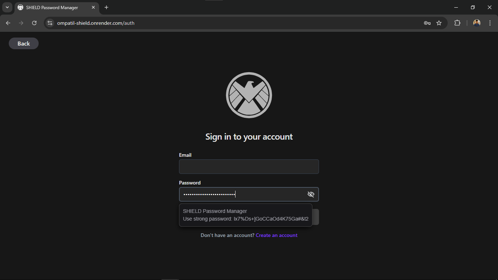

# SHIELD Password Generator

The SHIELD Password Generator is a Chrome extension designed to generate strong, secure passwords, addressing the challenge of creating complex passwords on the fly. This extension aims to simplify password management while providing a seamless user experience.

## Key Features

- **Strong Password Generation**: Quickly generates robust passwords to enhance your security.
- **Future Integration**: Planned integration with the [SHIELD Password Manager](https://github.com/ompatil-15/SHIELD-Password-Manager) for auto-filling login credentials and saving new login information directly using the extension.

With the SHIELD Password Generator, you can ensure that your passwords are both secure and easy to manage, paving the way for a more streamlined approach to online security.

## Installation

1. **Clone the Repository**:
   Open your terminal and run:
     ```bash
     git clone https://github.com/yourusername/shield-password-generator.git
     ```

2. **Navigate to the Directory**:
   Change to the extension's directory:
     ```bash
     cd shield-password-generator
     ```

3. **Load the Extension in Chrome**:
   - Open Google Chrome and go to `chrome://extensions/`.
   - Enable "Developer mode" in the top right corner.
   - Click on "Load unpacked" and select the directory where the extension is located.

## Sample Screenshots

<div style="display: flex; justify-content: space-around; flex-wrap: wrap;">
    
    
</div>

## Conclusion

The primary motivation behind creating this Chrome extension was to learn about how browser extensions work and to potentially integrate this extension with the [SHIELD Password Manager](https://github.com/ompatil-15/SHIELD-Password-Manager) to streamline the process of generating new credentials and managing all your passwords.
